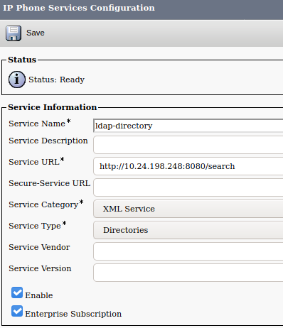

# ipps-javascript-samples

Sample apps demonstrating common usage scenarios for the Cisco IP Phone Services XML interface.

Included samples:

* `ldap_directory.js` - Configurable sample allowing search by first/last/phone against a LDAP directory, providing output as a directory service; supports non-secure and StartTLS connections (`<CiscoIPPhoneInput>`, `<CiscoIPPhoneDirectory>`, `<CiscoIPPhoneText>`).

* `push_init.js` - Demonstrate clearing local call-history and closing services/messages/directories UIs, using HTTP POST (`<CiscoIPPhoneExecute>`).

[IP Phone Services on DevNet](https://developer.cisco.com/site/ip-phone-services/)

## Pre-Requisites

* **NodeJS/NPM (v18+)** - [Node.js](https://nodejs.org) and [NPM](https://www.npmjs.com/) to install dependencies.  

    If you do not have Node/NPM installed, see the following guides:
    * Linux: http://blog.teamtreehouse.com/install-node-js-npm-linux
    * Mac: http://blog.teamtreehouse.com/install-node-js-npm-mac
    * Windows: http://blog.teamtreehouse.com/install-node-js-npm-windows

* **An IDE or developer code editor** - This project was built using [Visual Studio Code](https://code.visualstudio.com/), which has great support for debugging Node.JS

* **Git** - Source code management and sharing [Git](https://git-scm.com/book/en/v2/Getting-Started-Installing-Git)

This sample was tested using:

* Ubuntu 23.04
* Node.js 18.16.0
* CUCM 14
* OpenLDAP 2.4

## Running the Samples

1. From a terminal window, use `git` to clone this repo:

    ```bash
    git clone https://github.com/CiscoDevNet/ipps-javascript-samples
    ```

1. Change into the repo directory, and install dependencies with `npm`:

    ```bash
    cd ipps-javascript-samples
    npm install
    ```

1. Open the project in your IDE.

    For Visual Studio code:
    
    ```bash
    code .
    ```

1. Rename `.env.example` to `.env` 

    Then open it and enter your configuration options.

    Be sure to save the file.

1. In VS Code, run/debug the app by switching to the **Run** tab, selecting the desired sample from the dropdown in the upper-left, then clicking the green arrow - or just press **F5**.

1. Most samples will require configuring a Phone Service in CUCM.  This sample shows a typical configuration for the `ldap_directory.js` sample app:

    
